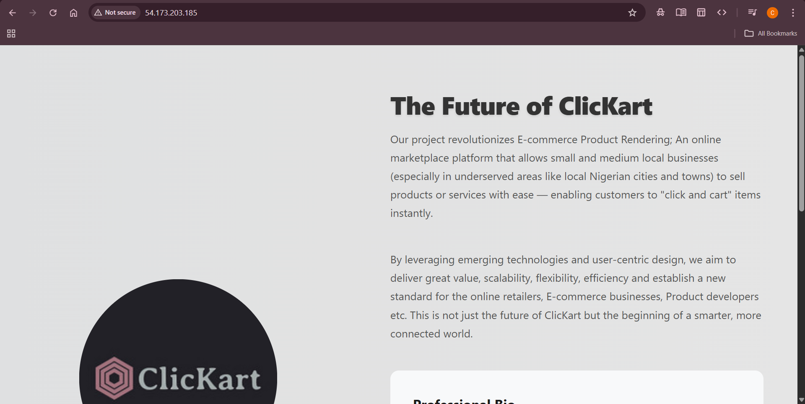

#  Altschool Cloud Engineering Second Semester Project

##  Project Title: **The Future of ClicKart**


###  Project Overview
This is a dynamic prototype of a landing page for a startup idea, **ClicKart**, an e-commerce platform aimed at seamless and efficient digital shopping experiences.

The project was deployed on a cloud server with Nginx, secured with SSL, and accessible via domain.

---

## 1. Landing Page

- Technologies: `HTML`, `CSS`, and `CSS animations`
- Includes:
  - My name and role: *Chidera Ojimba – Cloud Engineer*
  - Project title: **The Future of ClicKart**
  - A short description of the project itself.
  - A short professional bio
 ---

## 2.  Provision a server

- Cloud Provider: **AWS EC2**
- OS: **Ubuntu**
- Instance Type: `t2.micro` (Free Tier)
- Security group (created a key pair)
- Launched instance

---

## 3. Network and security

### Step 1 

i. install nginx

- sudo apt update -y && sudo apt upgrade -y

- sudo apt install nginx -y

- nginx --version

- which nginx

ii. Configured to serve the landing page from  `/var/www/html`

Allowed ports using ufw in the server:

80 for HTTP

443 for HTTPS


### Step 2: Ensure Nginx server was active

- sudo systemctl status nginx


### Step 3: Install certbot and other softwares for SSL configuration
- sudo apt install certbot -y

- sudo apt install python3-certbot-nginx -y

### Step 4: Secure with Let’s Encrypt SSL (Certbot)

- sudo certbot --nginx

Created a free domain name with https://freedns.afraid.org

- Input my email address: chideraojimba878@gmail.com
- Input domain name: https://clickart.crabdance.com/


---

## 4.  Git and Github

- Push landing page to Github

- git clone https://github.com/Derakings/Alt-exam.git
- cd repo folder
- sudo cp -r * /var/www/html

---
## 5. Where the page is hosted
- **Public IP address**: 54.173.203.185
- **Domain name**: https://clickart.crabdance.com/


## 6. Screenshots 


 **Before SSL configuration**


  
**After SSL configuration**


## 7.  Reverse proxy (Nginx proxying a Node.js app)
- Installed nodejs using this:
```bash
# Docker has specific installation instructions for each operating system.
# Please refer to the official documentation at https://docker.com/get-started/

# Pull the Node.js Docker image:
docker pull node:24-alpine

# Create a Node.js container and start a Shell session:
docker run -it --rm --entrypoint sh node:24-alpine

# Verify the Node.js version:
node -v # Should print "v24.2.0".

# Verify npm version:
npm -v # Should print "11.3.0".
```
- npm install Express (to build a simple and flexible nodejs app)
- Created Express app in `app.js` file
- edited the nginx config:
  ```bash
   sudo nano /etc/nginx/sites-available/default
  ```
  
Nginx server to forward (proxy) any incoming request that matches the current location /api/
``` bash
proxy_pass http://127.0.0.1:3000/;
    proxy_http_version 1.1;
    proxy_set_header Upgrade $http_upgrade;
    proxy_set_header Connection 'upgrade';
    proxy_set_header Host $host;
    proxy_cache_bypass $http_upgrade;
}
```
### Test and Reload NGINX
``` bash
sudo nginx -t
sudo sytemctl reload nginx
```
- Test my API through NGINX
- [Api link](curl https://clickart.crabdance.com/api/hello)
  
  ---
In summary, this is a mini full stack development
- Frontend: `HTML` & `CSS` (USER INTERACTION)
- Backend: Server operation (API, Databases)
-  Web Server configuration using NGINX as a reverse proxy for the backend
-  Cloud operation and Network security

--- 
**Project by**: OJIMBA CHIDERA .K.
 


