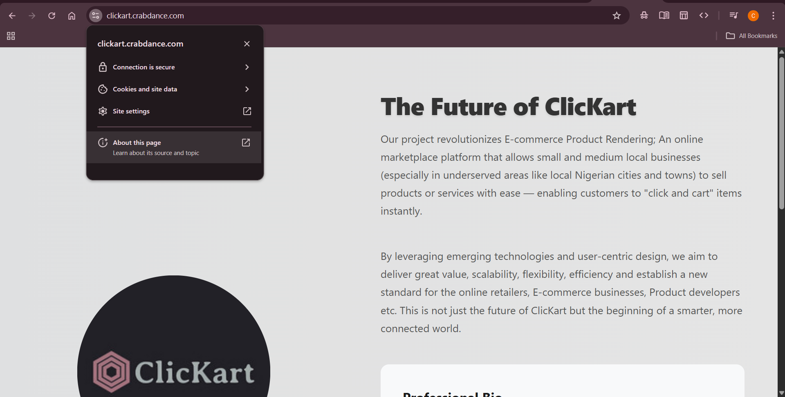

#  Altschool Cloud Engineering Second Semester Project

##  Project Title: **The Future of ClicKart**

###  Project Overview
This is a dynamic prototype of a landing page for a startup idea, **ClicKart**, an e-commerce platform aimed at seamless and efficient digital shopping experiences.

The project was deployed on a cloud server with Nginx, secured with SSL, and accessible via domain.

---

## 1. Landing Page

- Technologies: `HTML`, `CSS`, and `CSS animations`
- Includes:
  - My name and role: *Chidera Ojimba – Cloud Engineer*
  - Project title: **The Future of ClicKart**
  - A short description of the project itself.
  - A short professional bio
 ---

## 2.  Provision a server

- Cloud Provider: **AWS EC2**
- OS: **Ubuntu**
- Instance Type: `t2.micro` (Free Tier)
- Security group (created a key pair)
- Launched instance

---

## Network and security

### Step 1 

i. install nginx

- sudo apt update -y && sudo apt upgrade -y

- sudo apt install nginx -y

- nginx --version

- which nginx

ii. Configured to serve the landing page from  `/var/www/html`

Allowed ports using ufw in the server:

80 for HTTP

443 for HTTPS

### Step 2: Ensure Nginx server was active

- sudo systemctl status nginx

### Step 3: Install certbot and other softwares for SSL configuration
- sudo apt install certbot -y

- sudo apt install python3-certbot-nginx -y

### Step 4: Secure with Let’s Encrypt SSL (Certbot)

- sudo certbot --nginx

Created a free domain name with https://freedns.afraid.org

- Input my email address: chideraojimba878@gmail.com
- Input domain name: https://clickart.crabdance.com/

---

### 3.  Git and Github

- Push landing page to Github

- git clone https://github.com/Derakings/Alt-exam.git
- cd repo folder
- sudo cp -r * /var/www/html

---
### 4. Where the page is hosted
- **Public IP address**: 54.173.203.185
- **Domain name**: https://clickart.crabdance.com/

### 5. Screenshots 

 **Before SSL configuration**

  
**After SSL configuration**

